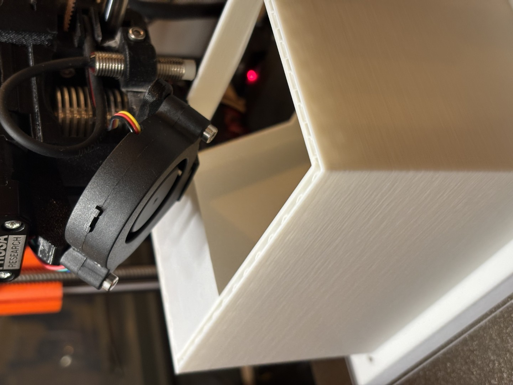

How to optimize for certain scenarios

## Bridging
Based on [Make Wonderful Things's research](https://www.youtube.com/watch?v=eaasEkFULKE),
- Speed\Bridges: `10`mm/s
- Advanced\Bridge flow ratio: `1.2`
- For even better results, see [follow up video and use OrcaSlicer](https://www.youtube.com/watch?v=Mrs2kAuRCBk)

Perfect unsupported bridge with these settings:

## Clog prevention

### Clog cause
Small details may cause many retract with low flow. The **heat creep** increases temperature in the nozzle above the melt zone, filament softens/swells in the nozzle and increases its resistance.
Once resistance is too high for the gears, they skip and grind a weak spot into the filament — which can eventually snap and lodge somewhere a cold pull can't reach

### Prevention

- Keep retraction distance short (Nextruder direct drive: ~0.6–1mm)
- Lower retraction/deretraction speed if grinding is the issue (helped others: 45→25mm/s retract, 25→15mm/s deretract)
- Idler tension: enough to grip, not extra-tight (over-clamping shears already-thin/ground filament more easily)
- Tune Pressure/Linear Advance to reduce pressure swings at direction changes
- Vent the chamber for PLA (heat creep risk is higher enclosed)

### Slicing settings
- Raise "Minimum travel after retraction" so tiny hops inside the detail skip retraction entirely.
  - start ~2–3mm
- Enable "Avoid crossing perimeters" to route travel over solid material
- Increase nozzle temp +5°C to keep the melt zone stable through bursty/low flow

- Combating ooze from skipped-retraction hops
  - Short hops = short ooze window, usually negligible
  - Increase travel speed over those gaps to reduce dwell time
  - Wipe while retracting (only applies to travels that do retract)
  - Retract before wipe % — leave at 0% (factory default for direct drive); this setting mainly matters for Bowden setups relieving pressure before wiping, not direct drive

## Misc
 - Tensile strength: the print is the weakest in the Z dimension, where layers adhere to one another. When your piece needs to be strong in multiple dimensions, consider splitting it into multiple parts and printing them such that the strongest forces act on the XY pane. See grill hooks below.
- Fillet increases strength of a corner in the Z dimension (across layer lines)
- Fillet allows for high print speed in the direction of the curve
- Chamfer at 45% degree is a simple way to build overhangs
